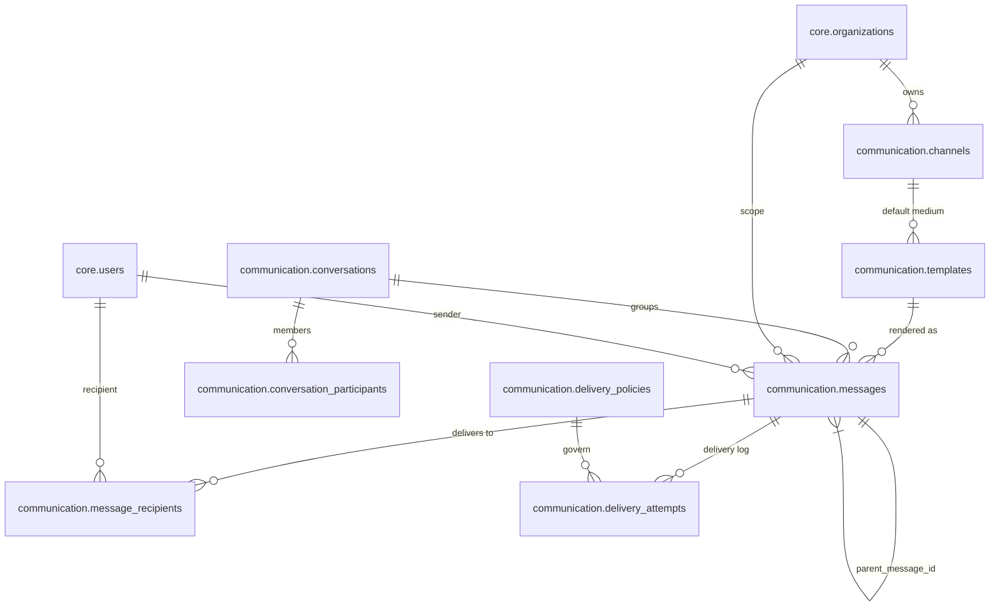

# Communication Schema Guide

Sprint 29 introduced the communication schema to persist omni-channel notifications, delivery policies, and threaded conversations. The design maps directly to R20.6 Part 2.1 (message storage) and R20.1 Part 3.2 (delivery lifecycle) while mirroring the hardening patterns proven in Sprint 28 RBAC work.

## ERD



## Table Reference

### communication.channels
*Columns*: `id`, `organization_id`, `channel_type`, `name`, `config`, `enabled`, `metadata`, `created_at`, `updated_at`
*Notes*: JSONB config documents provider credentials (SMTP, Twilio, FCM, WebSocket). Composite index `(organization_id, channel_type)` keeps tenant lookups <5ms.

### communication.templates
*Columns*: `id`, `organization_id`, `channel_type`, `name`, `subject`, `body`, `variables`, `locale`, timestamps
*Checks*: `jsonb_typeof(variables) = 'array'` and each `{{variable}}` must exist in `body` per R20.6 placeholder guidance.

### communication.delivery_policies
*Columns*: `id`, `organization_id`, `name`, `retry_config`, `throttling_config`, `quiet_hours`, timestamps
*Usage*: R20.1 Part 3.3 mandates scheduling metadata for queue compliance; JSON payload stores exponential vs. aggressive retry choices.

### communication.messages
*Columns*: `id`, `organization_id`, `sender_id`, `channel_type`, `template_id`, `subject`, `body`, `variables`, `metadata`, `parent_message_id`, `created_at`, `queued_at`
*Indexes*: `idx_messages_sender`, `idx_messages_parent` (threading), `idx_messages_metadata` (GIN). Self FK enables timeline + tree queries under 100ms for 50 message threads.

### communication.message_recipients
*Columns*: `id`, `message_id`, `recipient_id`, `read_at`, `delivered_at`, timestamps
*Notes*: Unique `(message_id, recipient_id)` prevents duplicate deliveries. `idx_recipients_user (recipient_id, read_at)` satisfies <50ms unread query.

### communication.delivery_attempts
*Columns*: `id`, `message_id`, `channel_type`, `status`, `attempt_number`, `scheduled_at`, `sent_at`, `delivered_at`, `failed_at`, `error_message`, `metadata`
*Indexes*: `(message_id, attempt_number)` for audit, `(status, scheduled_at)` to dequeue `queued`/`failed` attempts efficiently per R20.1 queue spec.

### communication.conversations & conversation_participants
*Columns*: conversation `id`, `organization_id`, `subject`, `status`, metadata, timestamps. Participants table tracks `conversation_id`, `user_id`, `role`, `joined_at`, `last_read_at` with uniqueness per user.

### communication.schema_migrations
Tracks applied migration filenames + checksums. Required for CLI status + rollback operations.

## Integration Points
- **core.users**: referenced by `messages.sender_id` and `message_recipients.recipient_id`; ensures SoD enforcement via authz memberships (R28). Insert sender + recipient rows before seeding sample data.
- **core.organizations**: multi-tenant isolation for all communication tables. Cascading deletes remove orphaned messages when tenants are decommissioned.
- **authz.memberships**: delivery runtime (B29.3) queries membership graph before dispatching each message.
- **preferences.user_preferences**: upcoming mission reads opt-in/out flags to decide which `channels` may be used per user.

## Query Patterns

### Fetch unread inbox items (<50 ms target)
```sql
SELECT m.id, m.subject, mr.delivered_at
FROM communication.message_recipients mr
JOIN communication.messages m ON m.id = mr.message_id
WHERE mr.recipient_id = $1 AND mr.read_at IS NULL
ORDER BY mr.delivered_at DESC
LIMIT 100;
```
Uses `idx_recipients_user` for recipient scope and timestamp ordering.

### Conversation timeline (<100 ms target)
```sql
WITH RECURSIVE thread AS (
  SELECT id, parent_message_id, subject, created_at
  FROM communication.messages
  WHERE id = $1
  UNION ALL
  SELECT child.id, child.parent_message_id, child.subject, child.created_at
  FROM communication.messages child
  JOIN thread ON child.parent_message_id = thread.id
)
SELECT * FROM thread ORDER BY created_at;
```
`idx_messages_parent` enables recursion anchored on parent chains defined in R20.6 Part 2.3.

### Delivery queue (<20 ms target)
```sql
SELECT id, message_id, scheduled_at, attempt_number
FROM communication.delivery_attempts
WHERE status IN ('queued', 'failed')
ORDER BY scheduled_at
LIMIT 500;
```
Relies on `(status, scheduled_at)` index; supports retry orchestration defined in R20.1 Part 3.2.

## References
- **R20.6 Part 2.1 TABLE 1** – message storage requirements (metadata, JSONB fields).
- **R20.6 Part 2.3** – threaded conversation pattern (parent pointers).
- **R20.1 Part 3.2 / 3.3** – delivery lifecycle + retry logic (status enum, scheduling, attempt counters).
