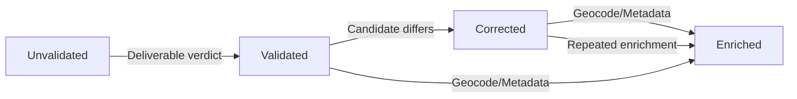

# Address Validation Lifecycle

Mission **B25.3 – Address Validation Lifecycle** introduces the runtime layer that upgrades `AddressMetadata` from a passive schema into an actively managed lifecycle driven by external validation providers (Google Address Validation API is the first adapter).

## What This Delivers

1. **Canonical verdict schema** – [`ValidationVerdict`](../../src/schemas/validation-verdict.ts) captures deliverability, granularity, and per-component confirmation states.
2. **Lifecycle state machine** – [`AddressValidationLifecycle`](../../src/traits/addressable/validation-lifecycle.ts) advances metadata from _unvalidated → validated → corrected → enriched_.
3. **Service abstraction** – [`validateAddress`](../../src/traits/addressable/validation-service.ts) normalizes addresses, invokes providers, and emits `AddressMetadata`.
4. **Google Address Validation adapter** – [`GoogleAddressValidationAdapter`](../../src/traits/addressable/google-av-adapter.ts) turns the Maps Platform response into canonical verdicts, component statuses, geocodes, and enrichment metadata.
5. **Geocode utilities** – [`geocoder.ts`](../../src/traits/addressable/geocoder.ts) maps provider-specific payloads to the shared `AddressGeocode`.
6. **Documentation, tests, and examples** – A dedicated guide (this file), deterministic Vitest suites, and runnable examples under `examples/addresses`.

## Lifecycle Overview



`AddressValidationLifecycle` enforces monotonic progression:

| State | Trigger |
| --- | --- |
| `validated` | Deliverable verdict with no corrections |
| `corrected` | Provider emits a corrected address or component-level adjustments |
| `enriched` | Geocode precision, residential/business flags, PO box detection, or explicit enrichment metadata |

Once enriched, subsequent validations retain the `enriched` status even if newer verdicts omit enrichment signals. Flags and geocode snapshots merge immutably across runs.

## Validation Service API

```ts
import { validateAddress } from '@/traits/addressable/validation-service';
import { GoogleAddressValidationAdapter } from '@/traits/addressable/google-av-adapter';

const provider = new GoogleAddressValidationAdapter({ apiKey: process.env.GOOGLE_ADDRESS_VALIDATION_API_KEY });
const outcome = await validateAddress(addressInput, { provider });

// outcome.metadata – normalized AddressMetadata
// outcome.correctedAddress – provider-supplied canonical address (if any)
// outcome.verdict – machine-readable deliverability verdict
// outcome.components – per-field confirmation/correction ledger
```

Key helper exports:

| Export | Description |
| --- | --- |
| `AddressValidationProvider` | Interface implemented by adapters |
| `setDefaultValidationProvider()` | Registers a default provider for convenience |
| `AddressValidationError` | Normalized error surface (missing provider, invalid verdict, configuration failures) |

## Google Adapter

`GoogleAddressValidationAdapter` handles:

- REST invocation with `fields` mask + API key management
- Translation of `verdict`, `address.postalAddress`, `geocode`, and `metadata` to canonical structures
- Component-level status inference (confirmed/unconfirmed/inferred/missing)
- Geocode normalization via `toAddressGeocodeFromGoogle`
- Enrichment metadata (residential/business/PO Box, DPV flags, etc.)

Tests stub `fetch` and assert both the request payload and downstream metadata mapping (`tests/traits/addressable/validation.test.ts`).

## Example Usage

See [`examples/addresses/validation-examples.ts`](../../examples/addresses/validation-examples.ts) for a runnable helper that validates the sample Google campus address once you set `GOOGLE_ADDRESS_VALIDATION_API_KEY`.

## Testing & Guardrails

- `tests/traits/addressable/validation.test.ts` – service + Google adapter contract tests
- `tests/traits/addressable/validation-lifecycle.test.ts` – lifecycle transitions (validated/corrected/enriched)
- Enforced TypeScript strictness (`ValidationVerdictSchema` + `AddressMetadataSchema`)
- Provider-neutral error handling and deterministic timestamps via injectable clocks

Before integrating into PR flows:

```
pnpm vitest tests/traits/addressable/validation.test.ts
pnpm vitest tests/traits/addressable/validation-lifecycle.test.ts
```

## Next Steps

- Upcoming missions (B25.4/B25.5) will surface lifecycle data inside view contexts and editors.
- Additional adapters (USPS, SmartyStreets) simply implement `AddressValidationProvider` and reuse the lifecycle + metadata binding.
