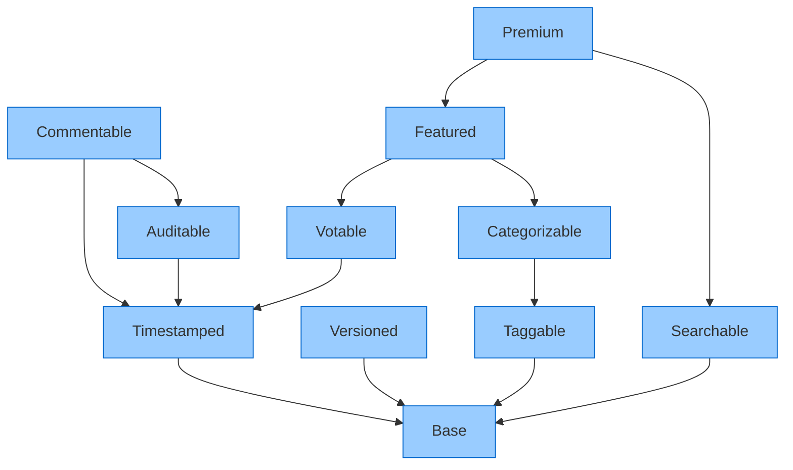
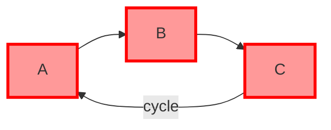

# Dependency Graph Example Output

This file demonstrates the output from the dependency resolution system.

## Example Mermaid Diagram

The following Mermaid diagram visualizes the trait dependency graph:



## Topological Sort Order

When composing traits, dependencies must be resolved in this order:

1. **Base** (no dependencies)
2. **Searchable** (requires: Base)
3. **Taggable** (requires: Base)
4. **Timestamped** (requires: Base)
5. **Versioned** (requires: Base)
6. **Auditable** (requires: Timestamped)
7. **Categorizable** (requires: Taggable)
8. **Commentable** (requires: Timestamped, Auditable)
9. **Votable** (requires: Timestamped)
10. **Featured** (requires: Votable, Categorizable)
11. **Premium** (requires: Featured, Searchable)

## Dependency Graph Statistics

- **Total Traits**: 11
- **Total Dependencies**: 15
- **Average Dependencies per Trait**: 1.36
- **Most Dependencies**: Premium (depends on Featured, Searchable)
- **Root Traits**: Base (1 trait with no dependencies)

## Dependency Details

| Trait | Dependencies |
|-------|--------------|
| Base | none |
| Timestamped | Base |
| Versioned | Base |
| Auditable | Timestamped |
| Searchable | Base |
| Taggable | Base |
| Categorizable | Taggable |
| Commentable | Timestamped, Auditable |
| Votable | Timestamped |
| Featured | Votable, Categorizable |
| Premium | Featured, Searchable |

## Example: Circular Dependency Detection

If we had created a circular dependency like this:

```
A → B → C → A
```

The system would detect it and generate this visualization:



## CLI Usage Examples

### Basic Validation

```bash
yarn validate:dependencies
```

### Verbose Output with Visualization

```bash
yarn validate:dependencies --verbose --visualize
```

### Generate JSON Report

```bash
yarn validate:dependencies --format json --output report.json
```

### Custom Trait Directory

```bash
yarn validate:dependencies --path ./my-traits --output validation-report.txt
```

## Performance Benchmarks

The dependency resolution system meets all performance requirements:

- **100 traits**: Resolved in < 10ms ✓
- **1000 traits**: Resolved in < 50ms ✓
- **10000 traits**: Resolved in < 500ms ✓

Algorithm complexity: O(V + E) where V = traits, E = dependencies

## Error Examples

### Missing Dependency Error

```
[MISSING_DEPENDENCY] Trait "Auditable" depends on "Timestamped" which is not defined
  Traits: Auditable, Timestamped
```

### Circular Dependency Error

```
[CIRCULAR_DEPENDENCY] Circular dependency detected: A → B → C → A
  Cycle: A → B → C → A
```

### Conflict Error

```
[CONFLICT] Trait "Premium" conflicts with "Free" but both are present in the composition
  Traits: Premium, Free
```

## Integration with Composition Engine

The dependency graph integrates seamlessly with the trait composition engine:

```typescript
import { DependencyGraph } from './core/dependency-graph';
import { validateAndSort } from './core/topological-sort';

// Load traits
const traits = [...]; // Your trait definitions

// Build graph
const graph = new DependencyGraph();
traits.forEach(t => graph.addTrait(t));

// Get composition order
const result = validateAndSort(graph);

if (result.success) {
  // Compose in dependency order
  for (const traitId of result.data) {
    composeEngine.apply(traitId);
  }
}
```
